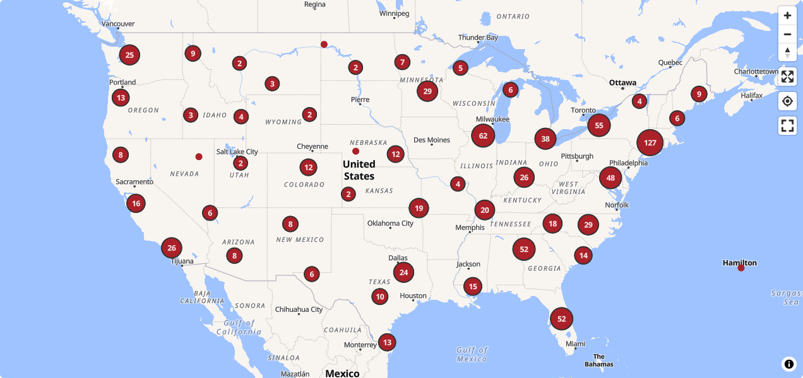

# USATF Calibration Course Map

[Map](https://calcourses.nickwalker.us/) of courses of known length, taken from the [USATF Course Database](https://certifiedroadraces.com/search/) with additional metadata from [Mark Neal's map](https://www.rrtc.net/Calibrations_map/calibration_map.html). Used by road-running [course measurers](https://www.usatf.org/resources/course-certification) to calibrate odometer-equipped bicycles before and after measurements.

## Contributing

If you find an issue with a course:

* Details like course length, city and state, were pulled directly from the USATF database, so ensure the database entry is correct. Contact [your regional certifier](https://www.rrtc.net/Certifiers/Certifiers.html) to make corrections to database errors.
* If the database entry is correct, open an issue or [comment in the measurers' forum](https://measure.infopop.cc/topic/yet-another-map-of-calibration-courses?reply=730081515202239286#730081515202239286) describing the problem and the fix.

If you have a more precise location for a course, especially the GPS coordinates of the end points, please send them via the forum.

### Detailed Course Locations

This repo's `[data/additional_data.geojson]` has GPS coordinates for the endpoints of a small number of courses. If you